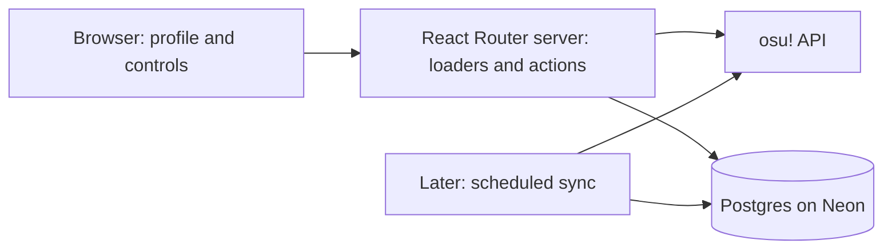

Practical backend research for osuProgression

The current recommendation includes Express. Follow the [Express backend research guide](/Users/plee/Desktop/osuProgression/docs/express-backend-research.md); the framework-only recommendation below is retained as earlier research.

Researched September 20, 2026. This guide assumes the goal is to learn backend development while making this existing app work. Recommendations and exercises are tailored design advice; provider behavior and learning resources are linked to their original documentation. This was a source-code and documentation review, not a live database audit or deployment.

**My recommendation is to keep React Router as your server, use Postgres on Neon for persistence, add Drizzle with the `pg` driver, and deploy the full app as a Render web service.** Start with one real player and stored snapshots. Add account login and saved preferences after that works.

Your backend consists of several jobs: handling requests, applying application rules, calling osu!, storing records, identifying signed-in users, and running somewhere when your laptop is off. A database supplies only the storage part. React Router can handle requests and call both your database and external APIs from server code. [React Router architecture](https://reactrouter.com/explanation/backend-for-frontend)



**Your project already supplies the starting point.**

| What I inspected | Current state | What to add |
| --- | --- | --- |
| [React Router configuration](/Users/plee/Desktop/osuProgression/react-router.config.ts:6) and [scripts](/Users/plee/Desktop/osuProgression/package.json:6) | SSR enabled; build and server-start commands exist | Server loaders/actions within the existing app |
| [Profile page](/Users/plee/Desktop/osuProgression/app/routes/profile.tsx:230) | Preferences in React state; player data hardcoded at line 252 | Database-backed reads and saved preferences |
| [Neon configuration](/Users/plee/Desktop/osuProgression/neon.ts:3) | Tooling/configuration exists; no application DB client, schema, migrations, or queries found | A connection module and versioned schema |
| [Cookie helper](/Users/plee/Desktop/osuProgression/app/services/cookies.server.ts:3) | Declares a preferences cookie; no working login/session flow found | Account login and session handling when personal writes are introduced |
| [API experiment](/Users/plee/Desktop/osu-api-spike/src/index.ts:46) | Demonstrates profile and score calls in a CLI script | Reusable server functions and web callback routes |
| [Container](/Users/plee/Desktop/osuProgression/Dockerfile:1) | Existing Node 24 build/run container | Host configuration and runtime environment variables |

The API experiment is useful reference material. Its callback currently parses a substring without checking OAuth state, and its imported `osu-api-v2-js` package is absent from that project's package manifest. Treat it as an experiment to learn from before implementing website login.

**Read these resources in the order you need them, and produce something after each one.**

| Priority | Resource | What to learn | Exercise in this project |
| --- | --- | --- | --- |
| 1 | [MDN: Server-side first steps](https://developer.mozilla.org/en-US/docs/Learn_web_development/Extensions/Server-side/First_steps) | Requests, responses, dynamic sites, and server responsibilities | Explain what happens between opening `/profile` and seeing data. Identify where the API secret and database connection belong. |
| 2 | [React Router data loading](https://reactrouter.com/start/framework/data-loading) and [actions](https://reactrouter.com/start/framework/actions) | Server reads, form submissions, and refreshing displayed data | Replace one hardcoded field with loader data; practice validating a form submission locally. Add durable personal writes at priority 7. Use the **Framework Mode** examples matching this repository. |
| 3 | [PostgreSQL tutorial](https://www.postgresql.org/docs/current/tutorial.html) | Tables, inserts, joins, aggregates, foreign keys, and transactions | Create players and snapshots; retrieve one player's latest two observations. Start with Chapters 1–2, then foreign keys and transactions. |
| 4 | [PostgreSQL Exercises](https://pgexercises.com/) | Practice writing SQL instead of only reading it | Finish basic filtering, joins, and aggregation; adapt one query to progression data. This is the author's exercise site, not official Postgres documentation. |
| 5 | [Neon connection guide](https://neon.com/docs/connect/choose-connection) and [Neon + Drizzle](https://neon.com/docs/guides/drizzle) | Connect your application and manage its schema | Add a server-only DB module, a first migration, and one saved record. Follow the `node-postgres` path for the proposed Node host. |
| 6 | [osu! authentication](https://osu.ppy.sh/docs/index.html#authentication) and [wrapper maintainer's guide](https://github.com/TTTaevas/osu-api-v2-js) | Public API access now; account authorization later | Fetch one real profile server-side and normalize only the fields the card needs. Choose either direct HTTP or the wrapper consistently. |
| 7 | [React Router sessions and cookies](https://reactrouter.com/explanation/sessions-and-cookies) and [form validation](https://reactrouter.com/how-to/form-validation) | Session lifecycle, ownership checks, and server validation | Save the signed-in player's card settings and retain them after a refresh. |
| 8 | [Render web services](https://render.com/docs/web-services) and [React Router deployment](https://reactrouter.com/start/framework/deploying) | Build, start, environment variables, ports, and server hosting | Deploy the same app and confirm stored data survives a restart. |
| 9 | [Playwright API testing](https://playwright.dev/docs/api-testing) and [React Router testing](https://reactrouter.com/start/framework/testing) | Verify real request/database/browser behavior | Exercise saving and reloading preferences, invalid input, and access by the wrong user against a test database. |

**A practical build sequence is more useful than finishing an entire course first.**

1. **Read a real player.** Introduce `app/services/osu.server.ts` and a profile loader. Initially use a fixed test player or a validated numeric player ID. Normalize upstream responses into the fields your card displays. Show a clear missing-player or upstream-error state. Success: the profile card displays current public data without embedding credentials in client code.
2. **Persist a player and one observation.** Create a development database branch, configure the driver, generate a migration, and run a local import script. Let the profile loader read stored data. Show when it was last updated. Success: stop and restart the app and see the same stored observation.
3. **Collect progression.** Make a second import at a later time; retain both observations. Query them by player, ruleset, and observation time. Success: display a real delta between observations, with an honest start-of-tracking date. Before publishing refresh controls, add throttling and restrict who can trigger expensive work.
4. **Add login and personal preferences.** Complete account authorization, establish a server session, then add the profile action. Determine ownership from the verified session. Store one selected preset and an allowlisted set of visible fields. Success: preferences survive refresh and another account cannot modify them.
5. **Deploy and verify.** Build and run the production app locally, configure the host, apply reviewed migrations to the deployment database, then deploy. Success: profile reads, login, saves, error handling, and persistence work at the deployed URL.
6. **Automate collection later.** Move the proven importer into a finite scheduled job. Record its last success/failure and make retries safe. Success: data updates without a browser being open, while duplicate runs do not create duplicate logical observations.

Start with the first two steps. They teach the complete browser → server → external API/database → browser path with a small scope.

**The first schema can stay small.** These are proposed application tables, not migrations already applied.

| Table | Initial fields | Purpose |
| --- | --- | --- |
| `players` | `osu_user_id` primary key, username, avatar URL, country code, tracked-at timestamp | Stable identity and current public profile fields |
| `player_snapshots` | ID, player foreign key, ruleset, observed-at timestamp, pp, global/country rank, accuracy, play count, play-time seconds | Your own observed progression history |
| Later: `card_preferences` | Player foreign key, preset, visible-fields JSON, updated-at timestamp | Persist existing profile controls |
| Later: auth/session tables | Use the chosen session library's schema or a reviewed server-session design | Identify requests and expire/revoke sessions |

Use numeric IDs, UTC timestamps, and raw numeric values. Format hours, percentages, dates, and thousands separators in the UI. Index snapshots by player, ruleset, and observation time. Define a capture interval or idempotency key so a retry can reuse the same logical snapshot; a fresh timestamp alone does not prevent duplication. Current names can change, so do not make username the stable identifier. Keep estimated xPP/xRank as a later, separately validated model.

**The database setup should fit the runtime you chose.** For Render/Railway's persistent Node processes, Neon's connection guide recommends standard Postgres drivers such as `pg`. Drizzle adds typed schema/query code and migration generation. A plain `pg` SQL exercise is also useful for understanding what the ORM does. [Driver selection](https://neon.com/docs/connect/choose-connection), [parameterized SQL](https://node-postgres.com/features/queries)

The following are suggested commands for the implementation phase; they were not executed during this research:

```sh
npm install drizzle-orm pg dotenv
npm install -D drizzle-kit @types/pg
```

Create `app/db/schema.ts`, `app/services/db.server.ts`, and `drizzle.config.ts`. Configure the latter with your schema path and `DATABASE_URL_UNPOOLED`, then use:

```sh
npx drizzle-kit generate
# Inspect the generated SQL and confirm the target is the development database.
npx drizzle-kit migrate
```

Use the pooled `DATABASE_URL` for application traffic and the direct `DATABASE_URL_UNPOOLED` for migrations. Explicitly load the correct local environment file in scripts; `dotenv/config` defaults to `.env`, whereas `.env.local` needs explicit configuration. Production variables belong in the host's environment configuration. Keep migrations in Git and apply them once per deployment through a controlled step. [Neon + Drizzle setup](https://neon.com/docs/guides/drizzle), [Drizzle migration workflow](https://orm.drizzle.team/docs/migrations)

Mark database and credential-bearing service modules `.server.ts`. React Router checks that these do not enter the client dependency graph. Data returned by a loader is delivered to the browser, so return only the public fields needed by the page. [Server-only modules](https://reactrouter.com/api/framework-conventions/server-modules)

Version detail: the current generic Drizzle PostgreSQL quickstart uses `@rc` package tags. The commands above use the default release channel; follow documentation for the versions you install and keep ORM/Kit versions compatible. [Drizzle PostgreSQL quickstart](https://orm.drizzle.team/docs/get-started/postgresql-new)

**osu! integration has two different stages.** Client credentials with the `public` scope suit fetching public player data. Signing a person into your app uses authorization-code flow and `/me` with `identify`; validate returned OAuth state and use the exact registered callback URL. Read token expiry from the response. The published API terms specify a 60-request-per-minute ceiling and call for caching and irregular polling. Design a lower shared budget with backoff, especially once multiple users are tracked. [Authentication](https://osu.ppy.sh/docs/index.html#authentication), [API terms](https://osu.ppy.sh/docs/index.html#terms-of-use)

Treat the API as a source of observations, not a full historical archive. Current upstream implementation caps recent results at 100 and filters them to the last day. Those are implementation details that can change, but they demonstrate why a progression service needs its own snapshots and cannot guarantee lossless per-play capture. [Official controller implementation](https://raw.githubusercontent.com/ppy/osu-web/master/app/Http/Controllers/UsersController.php), [official score model](https://raw.githubusercontent.com/ppy/osu-web/master/app/Models/Solo/Score.php)

For eventual statistical experiments, inspect the [official downloadable datasets](https://data.ppy.sh/) and their coverage before planning large live-API collections. Your current xPP/xRank placeholders need their own definition, data, and validation work.

**Choose the login integration explicitly when you reach it.** Neon's managed OAuth guide currently documents Google, GitHub, and Vercel; it does not establish an osu! integration. Keep osu! identity as a requirement when evaluating an auth library. [Neon managed OAuth](https://neon.com/docs/auth/guides/setup-oauth)

[Better Auth's custom OAuth documentation](https://better-auth.com/docs/concepts/oauth) is a candidate research path for hosting account/session handling in your application. Its generic-provider support is not proof of a tested osu! integration: verify profile mapping, token exchange, and the exact installed version before choosing it. The session guide above is useful whichever integration you select. Store OAuth tokens on the server only if ongoing user-authorized access needs them; public-data syncing can be separate from login.

**Render is my first deployment choice here; Railway is a reasonable alternative.** Both fit the existing server/container model.

| Option | Setup for this repository | Cost and practical constraint, checked September 20, 2026 |
| --- | --- | --- |
| Render web service | Use existing Dockerfile, or native Node 24 with build `npm ci && npm run build` and start `npm run start` | Free sleeps after 15 idle minutes; waking typically takes about one minute. Paid web compute starts at $7/month for 512 MB, with other usage charges possible. |
| Railway service | Root Dockerfile is detected automatically; configure a public domain and runtime variables | Hobby starts at $5/month and includes $5 of resource usage; higher usage costs more. Free currently supplies $1/month credit after the trial. |
| Neon database | Reuse your project; separate development and deployment database environments | Free currently includes 0.5 GB storage and 100 CU-hours per project; compute suspends after five idle minutes. This is a separate bill/allowance from app hosting. |

Sources: [Render setup](https://render.com/docs/web-services), [Render free limits](https://render.com/docs/free), [Render pricing](https://render.com/pricing), [Railway Dockerfiles](https://docs.railway.com/builds/dockerfiles), [Railway plans](https://docs.railway.com/pricing/plans), [Railway trial](https://docs.railway.com/pricing/free-trial), [Neon pricing](https://neon.com/pricing). Recheck at purchase time. A reasonable initial paid-app baseline is $7/month for Render plus whatever database and metered usage your workload requires; that is not a guaranteed total bill.

Configure binding to `0.0.0.0` and the host's `PORT`. Add a small health route and configure the host to use it. Set database/API credentials at runtime, update the OAuth callback for the deployed domain, and keep app and database regions close. Your stored data belongs in Postgres so container replacement does not erase it. [Render web services](https://render.com/docs/web-services), [health checks](https://render.com/docs/health-checks)

For scheduled collection, [Render cron jobs](https://render.com/docs/cronjobs) and [Railway cron jobs](https://docs.railway.com/cron-jobs) run finite scripts. Both use UTC; Railway's minimum interval is five minutes, and Render has a $1/month minimum per cron job. Close database connections and exit at the end. Introduce a queue only when observed workload or retry requirements justify it.

**Use a deeper course when you want more practice with a specific concept.**

- [Full Stack Open Part 3: Node and Express](https://fullstackopen.com/en/part3/node_js_and_express/) teaches HTTP APIs through incremental exercises. Try exercises 3.1–3.6 in a separate learning folder. Its JavaScript/Express examples and later MongoDB material differ from this app's TypeScript/React Router/Postgres stack; transfer the concepts rather than its entire project structure.
- [Full Stack Open Part 4: backend testing](https://fullstackopen.com/en/part4/testing_the_backend/) provides useful success/failure and persistence scenarios. Its SuperTest/MongoDB examples need adaptation. Apply those behaviors using tests against your running application.
- [Full Stack Open relational databases course](https://courses.mooc.fi/org/uh-cs/courses/full-stack-open-relational-databases) is the new destination for the former Part 13. The move is confirmed in the [official course information](https://fullstackopen.com/en/part0/general_info/); old English lesson links returned 404 during research. The new site's app shell did not expose its complete syllabus to the research browser, so the current syllabus was not fully verified.

Full Stack Open assumes prior programming fluency and some web/database/Git basics. Use MDN and the Postgres tutorial first if those prerequisites feel unfamiliar. For the actual React Router routes, prefer a few integration/browser tests over trying to stub the whole application; the framework's testing guide makes this distinction. [Course prerequisites](https://fullstackopen.com/en/part0/general_info/), [React Router testing](https://reactrouter.com/start/framework/testing)

One more stale-tutorial trap: Arctic's homepage now states that the OAuth library was deprecated in July 2026, even though its osu! provider documentation remains searchable. Do not select it solely because an older tutorial recommends it. [Maintainer announcement](https://arcticjs.dev/)

The first concrete target is: **open the profile page, see a real osu! player loaded from your database, restart the application, and still see the stored observation with its capture time.** That is a useful working backend foundation and a clear place to begin.
