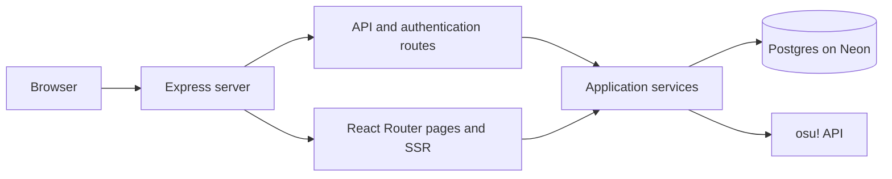

Practical Express backend research for osuProgression

Researched September 20, 2026. This is the recommended learning and implementation path with Express explicitly included. It supersedes the earlier framework-only recommendation. The research used the current repository, official framework/library documentation, and original course materials. No dependencies, application code, databases, or deployments were changed.

**Recommended stack: your existing React/React Router frontend, Node 24, Express 5, TypeScript, Postgres on Neon, Drizzle with `pg`, Zod, and Render.** Add `express-session` with a Postgres session store when you implement login, and Supertest for API integration tests. These are recommendations for this project, not a requirement to install everything before writing your first endpoint.

| Part | Responsibility |
| --- | --- |
| React + React Router | Pages, navigation, loading/pending states, and existing SSR |
| Express 5 | JSON endpoints, middleware, validation, authentication checks, and error responses |
| TypeScript | Types while developing; runtime input validation still belongs in the server |
| Postgres on Neon | Persistent players, statistics observations, preferences, and sessions |
| `pg` + Drizzle | Database transport, typed queries, schema definitions, and migrations |
| Zod | Validate route parameters, submitted data, and important external API responses |
| osu! OAuth + application sessions | Establish identity and remember subsequent signed-in requests |
| Supertest + Node's test runner | Exercise API behavior and database effects |
| Render web service | Run the Node application online |

**Use The Odin Project as your main course.** Its current [NodeJS curriculum](https://www.theodinproject.com/paths/full-stack-javascript/courses/nodejs) covers Express, PostgreSQL, authentication, APIs, and testing. That is a close match for the backend you want. It assumes working JavaScript, promises/async functions, npm, Git, and terminal familiarity; its PostgreSQL lesson also assumes SQL basics.

The sequence below is my adaptation for someone who already has a React frontend. In the original course, APIs come after lessons about server-rendered templates.

| Order | Read or complete | Apply it to this app | Completion check |
| --- | --- | --- | --- |
| 1 | [Introduction to Express](https://www.theodinproject.com/lessons/node-path-nodejs-introduction-to-express) | Create a tiny Express learning server with `GET /api/health` | `curl` receives HTTP 200 and JSON |
| 2 | [Routes](https://www.theodinproject.com/lessons/nodejs-routes) and [Controllers](https://www.theodinproject.com/lessons/nodejs-controllers) | Return a fixture from `GET /api/players/:osuId`; separate the route from data-access code | Invalid IDs give 400; missing records give 404 |
| 3 | [API Basics](https://www.theodinproject.com/lessons/nodejs-api-basics) | Connect a React component to the JSON endpoint | Loading, success, empty, and error states work |
| 4 | [Using PostgreSQL](https://www.theodinproject.com/lessons/nodejs-using-postgresql) | Create players and snapshots; replace the fixture with a database query | A stored observation survives an app restart |
| 5 | [Inventory Application project](https://www.theodinproject.com/lessons/node-path-nodejs-inventory-application) | Adapt the schema/CRUD exercise to tracked players, or complete its store project separately | Build relationships and updates without following every line of a tutorial |
| 6 | [Authentication Basics](https://www.theodinproject.com/lessons/node-path-nodejs-authentication-basics) | Learn cookie/session concepts, then use osu! authorization to establish identity | Login survives refresh; logout removes access |
| 7 | [Testing Routes and Controllers](https://www.theodinproject.com/lessons/nodejs-testing-routes-and-controllers) | Test success, invalid input, missing players, and denied personal writes | Tests run repeatably using a test database and mocked osu! calls |
| 8 | [Deployment](https://www.theodinproject.com/lessons/node-path-nodejs-deployment) plus [Render's Express walkthrough](https://render.com/docs/deploy-node-express-app) | Deploy the Express app and supply its environment variables | Database-backed requests succeed at the hosted URL |

Odin's examples are primarily JavaScript/CommonJS. Keep TypeScript and ESM (`import`/`export`) in this repository. Its early database material uses `pg`, but later ORM lessons use Prisma; use the SQL lessons, then switch to the Drizzle resources below if following the recommended stack. Its authentication tutorial demonstrates password login, which is a learning exercise rather than the desired osu! login flow. [Odin ORM lesson](https://www.theodinproject.com/lessons/nodejs-prisma-orm)

**Use these references alongside the course at the point they become useful.**

| Resource | Why it matters |
| --- | --- |
| [Express installation and TypeScript](https://expressjs.com/en/starter/installing/) | Start with the supported Express major version and correct TypeScript types |
| [Express middleware](https://expressjs.com/en/guide/using-middleware/) | Understand request order, `next()`, parsers, route guards, and response completion |
| [Express error handling](https://expressjs.com/en/guide/error-handling/) | Turn failures into predictable HTTP responses |
| [Express 5 migration guide](https://expressjs.com/en/guide/migrating-5/) | Resolve differences between current code and older tutorials |
| [PostgreSQL tutorial](https://www.postgresql.org/docs/current/tutorial.html) and [SQL exercises](https://pgexercises.com/) | Learn keys, joins, constraints, aggregates, and transactions before hiding everything behind an ORM |
| [node-postgres queries](https://node-postgres.com/features/queries) and [pooling](https://node-postgres.com/features/pooling) | Parameterized SQL and reusable database connections |
| [Neon driver selection](https://neon.com/docs/connect/choose-connection) and [Neon + Drizzle](https://neon.com/docs/guides/drizzle) | Connect the chosen Node runtime to the database |
| [Drizzle migrations](https://orm.drizzle.team/docs/migrations) | Keep schema changes in version control and apply them deliberately |
| [Zod basics](https://zod.dev/basics) | Validate input with a schema and handle failures explicitly |
| [Supertest](https://github.com/forwardemail/supertest) | Send test requests directly to an Express app and assert responses |

For an additional explanation, [Full Stack Open Part 3](https://fullstackopen.com/en/part3/node_js_and_express/) teaches JSON APIs and React integration well. Its [Part 4 testing chapter](https://fullstackopen.com/en/part4/testing_the_backend/) pairs Supertest with Node's test runner. Its current Express material includes Express 5; however, the database examples use MongoDB. Use it selectively for HTTP and testing. [Official course update information](https://fullstackopen.com/en/part0/general_info/)

[MDN's Express LocalLibrary tutorial](https://developer.mozilla.org/en-US/docs/Learn_web_development/Extensions/Server-side/Express_Nodejs/Tutorial_local_library_website) is a guided alternative, but it uses MongoDB/Mongoose and Pug templates. Odin requires less translation for your React/Postgres project. These course comparisons are my assessment of fit, not claims that one curriculum is universally better.

**Make Express responsible for real API behavior in your project.**

Your [configuration enables SSR](/Users/plee/Desktop/osuProgression/react-router.config.ts:6), and your [start script](/Users/plee/Desktop/osuProgression/package.json:8) currently launches `react-router-serve`. The lockfile contains React Router 8.3.1, including its Express adapter, and Express 5.2.1 transitively through the provided server. The change would be to own that server and add your own routes, middleware, and services.

For the deployed app, I recommend one custom Express server that mounts `/api` and `/auth`, then hands page requests to React Router. This preserves SSR and gives the browser a single origin for pages and API requests. React Router officially supports this arrangement. [Bring your own server](https://reactrouter.com/tutorials/quickstart#bring-your-own-server), [maintainer's custom-server template](https://github.com/remix-run/react-router-templates/tree/main/node-custom-server)



Begin learning with an isolated Express server that you can call with `curl`. Once the first endpoint works, bring its router/service modules into the custom-server layout. A separately deployed Express API is also viable if you want an independently operated service; it adds another deployment and requires deliberate cookie/origin handling. You can make that split later because the API modules remain independent.

One suggested final layout is:

```text
server.js                     Node entry point and development/production bootstrap
server/app.ts                 Express app and middleware mounting
server/api.ts                 API middleware/router assembly, independent of SSR
server/routes/players.ts       Public player endpoints
server/routes/me.ts            Authenticated preferences and refresh endpoints
server/routes/auth.ts          OAuth start, callback, and logout
server/services/osu.ts         Upstream HTTP calls and token handling
server/services/players.ts     Application rules and database operations
server/db/client.ts            Reused database connection/pool
server/db/schema.ts            Drizzle table definitions
server/middleware/errors.ts    API error mapping
drizzle.config.ts              Migration configuration
drizzle/                       Generated, reviewed SQL migrations
app/                           Existing React Router frontend
```

Routes translate HTTP input/output; services own application rules and queries. Browser interactions call `/api/...`. SSR loaders can call the same authorized service functions, passing the request's verified identity when needed. Keep authorization in shared operations as well as route guards so a second entry point cannot bypass it. Never import credential-bearing service modules into browser code.

**The current React Router version makes the template details important.**

When integrating, declare Express and the adapter as direct dependencies and keep the adapter aligned with the installed React Router version. Use the template's `server.js`, TypeScript server entry, and development/production workflow as a reference rather than replacing your whole project. Merge its Vite SSR entry configuration into your existing Tailwind/React Router setup. Current configuration uses `environments.ssr.build.rollupOptions.input`; older top-level examples may differ. [Template Vite configuration](https://github.com/remix-run/react-router-templates/blob/main/node-custom-server/vite.config.ts), [React Router 8 upgrade guidance](https://reactrouter.com/upgrading/v7)

The template's development command is `cross-env NODE_ENV=development node --conditions development server.js`; its build command is `react-router build`, and production starts with `node server.js` with `NODE_ENV=production` supplied by the host. The development condition matters for the current React Router/Vite integration. These replace the provided-server scripts during implementation. [Template scripts](https://github.com/remix-run/react-router-templates/blob/main/node-custom-server/package.json)

Register API/auth routes before the React Router handler. Mount JSON/form parsers only on routes that consume those bodies; a global parser can consume the stream before React Router reads form data. Return JSON 404 responses for unmatched `/api` routes so those requests do not fall through to an HTML page. This ordering recommendation follows Express's middleware model and the adapter's conversion of the Node request stream. [Express middleware](https://expressjs.com/en/guide/using-middleware/), [official adapter implementation](https://github.com/remix-run/react-router/blob/main/packages/react-router-express/server.ts)

Use `app.use(handler)` for the final React Router fallback. Old `app.all('*', ...)` examples use wildcard syntax that Express 5 changed. If passing Express session data into React Router 8 loaders, follow the current typed `RouterContextProvider` API. The official custom-server template shows the current pattern. [Express 5 route changes](https://expressjs.com/en/guide/migrating-5/), [template server app](https://github.com/remix-run/react-router-templates/blob/main/node-custom-server/server/app.ts)

**Build the backend through these observable milestones.**

| Milestone | Implementation | Evidence it works |
| --- | --- | --- |
| 1. HTTP | Health endpoint, player fixture, validation, API 404/error handling | `curl` gives correct JSON/status codes |
| 2. Persistence | Development database, first migration, seeded player and snapshot | Read survives restarting the server |
| 3. Real data | osu! client and a local import script that normalizes a real player | Database contains an observation with a capture timestamp |
| 4. UI integration | Custom Express host and React card reading stored data | Existing pages render and display real values |
| 5. Accounts | osu! callback, server session, owned preference updates | Sign in, save, refresh, sign out, and attempt a denied write |
| 6. Progression | Multiple snapshots, bounded history query, authenticated throttled sync | History is chronological and retries do not duplicate an observation |
| 7. Deployment | Production build, host variables, migration step, healthcheck | Hosted app preserves data and handles failures correctly |

For the initial HTTP lab, the relevant dependencies are:

```sh
npm install express@5 zod
npm install -D typescript tsx @types/express@5 @types/node@24
```

Run the lab with `tsx`, and type-check separately with TypeScript. The existing React Router project has a bundler-oriented `tsconfig` with `noEmit`, so a plain `tsc` does not automatically produce a standalone deployable server. Follow the custom-server template's build pipeline for the integrated app. [Express TypeScript setup](https://expressjs.com/en/starter/installing/), [Node TypeScript execution](https://nodejs.org/download/release/v24.15.0/docs/api/typescript.html)

At the persistence milestone, add `pg`, Drizzle ORM/Kit, and their types. First understand one parameterized `SELECT` and `INSERT` with `pg`; then define the project schema and generate/apply migrations with Drizzle. Prefer `DATABASE_URL` for runtime traffic and the direct `DATABASE_URL_UNPOOLED` for migrations. Use a development branch rather than experimenting against deployment data. Load the selected environment file explicitly in migration/import scripts. [Neon + Drizzle](https://neon.com/docs/guides/drizzle)

Start with `players` and `player_snapshots`, linked by stable osu! user ID. Each snapshot needs ruleset, observed-at time, pp, rank, accuracy, and any other metrics you actually display. Add preferences when login is working. Use unique capture keys or an equivalent constraint to make retrying one import safe. This is a proposed schema, not one already applied.

**Use a small, explicit API contract.** The following routes are suggested design, not existing endpoints.

| Endpoint | Behavior |
| --- | --- |
| `GET /api/health` | Return minimal process health information |
| `GET /api/players/:osuId` | Return a stored public profile, latest snapshot, and last-updated time |
| `GET /api/players/:osuId/history` | Return a bounded, validated time range for an explicit ruleset |
| `GET /api/me` | Return signed-in user information, or 401 |
| `PATCH /api/me/preferences` | Validate the preset/visible fields and update the session owner's record |
| `POST /api/me/sync` | After auth/throttling, fetch upstream data server-side and save an observation |
| `GET /auth/osu` and callback | Begin and complete provider authorization |
| `POST /auth/logout` | Destroy the application session |

Begin with a local import script before exposing sync publicly. The browser should request a refresh, not submit supposedly authoritative pp/rank values. For anticipated errors, choose stable error codes and statuses: malformed input 400, missing authentication 401, denied access 403, missing records 404, and throttled requests 429. Return a generic 500 for unexpected failures and log diagnostic details server-side.

**Account login needs both OAuth and a session.** The osu! authorization flow establishes who a person is; the application session associates later requests with that identity. Public-data collection can use client credentials independently of user login. Keep the OAuth client secret and tokens server-side, validate callback state, and match the registered callback URI. The API documentation is the source for provider details. [osu! authentication](https://osu.ppy.sh/docs/index.html#authentication)

For the Express session layer, study [express-session](https://expressjs.com/en/resources/middleware/session/) and the [connect-pg-simple maintainer's guide](https://github.com/voxpelli/node-connect-pg-simple). Store sessions in Postgres before deployment; the default `MemoryStore` is for development. Regenerate the session after successful login, persist it before redirecting, and destroy it on logout. Use an HTTP-only cookie, HTTPS security in production, and proxy settings matching the actual host. Include the session table in the migration process. The store's examples use Express 4, so verify the installed combination during implementation.

Use one session system for Express and SSR. Same-origin hosting simplifies browser cookie handling; it does not remove the need for authorization or CSRF protection on personal writes. If later splitting origins, configure exact allowed origins and credentials deliberately. CORS only controls browser access to responses. [Express CORS documentation](https://expressjs.com/en/resources/middleware/cors/), [OWASP CSRF guidance](https://cheatsheetseries.owasp.org/cheatsheets/Cross-Site_Request_Forgery_Prevention_Cheat_Sheet.html)

**A few tests should establish the actual behavior.** Export API middleware/routers independently of the SSR entry and mount them in a small Express test app for Supertest. Keep that setup separate from code that listens on a port. A plain Node/tsx test cannot directly load the combined server entry's Vite virtual module (`virtual:react-router/server-build`); test the running built server for combined SSR/API behavior. Use a separate test database and deterministic fixtures; mock osu! responses for ordinary test runs. Verify stored reads, malformed input, invalid presets, unauthorized writes, OAuth-state rejection, upstream failures, and duplicate-import handling. [Supertest documentation](https://github.com/forwardemail/supertest), [Full Stack Open testing](https://fullstackopen.com/en/part4/testing_the_backend/), [template server entry](https://github.com/remix-run/react-router-templates/blob/main/node-custom-server/server/app.ts)

**Deploy the server you actually built.** Render's Express guide explains web-service creation. For the integrated custom server, build both the UI and server with the template workflow, change the start command to launch the custom entry point, and include `server.js` in the final Docker image. Your current Dockerfile only copies the existing build output and package files, so it needs that adjustment during implementation. Set `NODE_ENV=production`, use the host's `PORT` and `0.0.0.0`, configure runtime secrets, and apply migrations once through a controlled deployment step. [Render Express deployment](https://render.com/docs/deploy-node-express-app), [Render web services](https://render.com/docs/web-services), [template bootstrap](https://github.com/remix-run/react-router-templates/blob/main/node-custom-server/server.js)

Render's free service sleeps after inactivity, which is acceptable for learning but affects the first request after idle time. Database usage is separate from app hosting. Check the current [Render free limits](https://render.com/docs/free), [Render prices](https://render.com/pricing), and [Neon prices](https://neon.com/pricing) before choosing paid services.

Two version pitfalls are especially relevant: Express 5 forwards rejected promises from returned/awaited async handlers to error middleware, so old `express-async-errors` setup is unnecessary for that behavior; and raw TypeScript annotations do not validate incoming requests. Use Express's current error model and Zod at the input boundary. [Express 5 changes](https://expressjs.com/en/guide/migrating-5/), [Zod basics](https://zod.dev/basics)

Start with Odin's Introduction to Express, Routes, and Using PostgreSQL. Your first complete outcome is **a React profile card reading a real, persisted player through an Express API, with the record still present after a restart**. Login, saved preferences, and scheduled collection build on that foundation.
